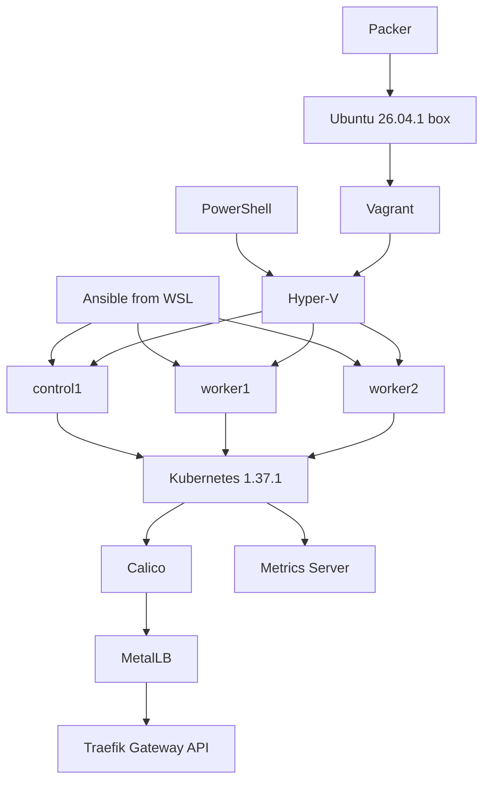

# Architecture

```mermaid
flowchart TB
 PS[PowerShell] --> HV[Hyper-V]
 PK[Packer] --> BOX[Ubuntu 26.04.1 box] --> VG[Vagrant] --> HV
 AN[Ansible from WSL] --> CP[control1]
 AN --> W1[worker1]
 AN --> W2[worker2]
 HV --> CP
 HV --> W1
 HV --> W2
 CP --> K[Kubernetes 1.37.1]
 W1 --> K
 W2 --> K
 K --> C[Calico]
 C --> M[MetalLB]
 M --> T[Traefik Gateway API]
 K --> MS[Metrics Server]
```

Component versions are defined once in `ansible/inventory/group_vars/all.yml`. See [Networking](networking.md) for the two-NIC network layout.
