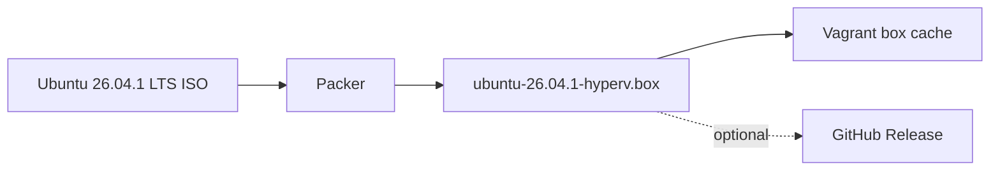

# Image build

```mermaid
flowchart LR
 ISO[Ubuntu 26.04.1 LTS ISO] --> P[Packer] --> B[ubuntu-26.04.1-hyperv.box] --> L[Vagrant box cache]
 B -. optional .-> G[GitHub Release]
```
The ISO URL and SHA-256 are pinned in the Packer template. Generated `.box` files are excluded from Git.
