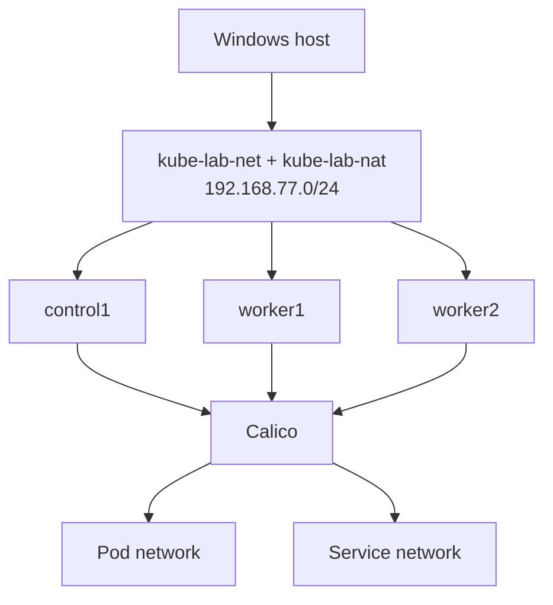

# Networking

```mermaid
flowchart TB
 W[Windows host] --> N[kube-lab-net + kube-lab-nat<br/>192.168.77.0/24]
 N --> CP[control1]
 N --> W1[worker1]
 N --> W2[worker2]
 CP --> C[Calico]
 W1 --> C
 W2 --> C
 C --> P[Pod network]
 C --> S[Service network]
```
Host networking and Kubernetes networking are separate troubleshooting layers.
