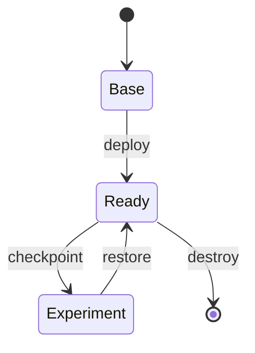

# Snapshots

```mermaid
stateDiagram-v2
 [*] --> Base
 Base --> Ready: deploy
 Ready --> Experiment: checkpoint
 Experiment --> Ready: restore
 Ready --> [*]: destroy
```
Checkpoint helpers treat the three VMs as a lab state.
